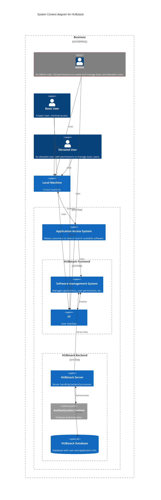

```mermaid
    C4Context
        title System Context diagram for HUBstack
        Enterprise_Boundary(b0, "Business") {
            Person(userA, "Admin", "An Admin User, full permissions to create and manage basic and elevated users.")
            Person(userB, "Basic User", "A basic User, minimal access.")
            Person(userC, "Elevated User", "An elevated user, with permissions to manage basic users.")

            System(SystemF, "Local Machine", "A local machine.")

            System_Boundary(b1, "") {
                System(SystemA, "Application Access System", "Allows customers to view or launch available software.")
    
                System_Boundary(b2, "HUBstack Frontend") {
                    System(SystemE, "Software management System", "Manages applications, user permissions, etc.")
                    System(SystemH, "UI", "User Interface")
                }
    
                System_Boundary(b3, "HUBstack Backend") {
                    System(SystemG, "HUBstack Server", "Server handling backend processes.")
                    System_Ext(SystemC, "Authentication System", "Firebase Authentication.")
                    SystemDb(SystemD, "HUBstack Database", "Database with user and application info.")
                }
            }
        }

        Rel(userA, SystemF, "Uses")
        Rel(userB, SystemF, "Uses")
        Rel(userC, SystemF, "Uses")
        Rel(userA, SystemH, "Uses")
        Rel(userB, SystemH, "Uses")
        Rel(userC, SystemH, "Uses")
        BiRel(SystemF, SystemA, "Accesses")
        Rel(SystemA, SystemE, "Uses")
        Rel(SystemG, SystemE, "Serves Data")
        BiRel(SystemC, SystemG, "Authenticates")
        Rel(SystemG, SystemD, "Serves")
        BiRel(SystemE, SystemH, "Displays")

        UpdateElementStyle(userA, $fontColor="white", $bgColor="grey", $borderColor="red")
        UpdateRelStyle(userA, SystemA, $textColor="blue", $lineColor="blue", $offsetX="5")
        UpdateRelStyle(SystemA SystemE, $textColor="blue", $lineColor="blue", $offsetY="-10")
        UpdateRelStyle(SystemA, SystemC, $textColor="blue", $lineColor="blue", $offsetY="-40", $offsetX="-50")
        UpdateRelStyle(SystemC, customerA, $textColor="red", $lineColor="red", $offsetX="-50", $offsetY="20")

    UpdateLayoutConfig($c4ShapeInRow="3", $c4BoundaryInRow="1")
```
